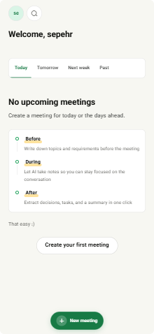
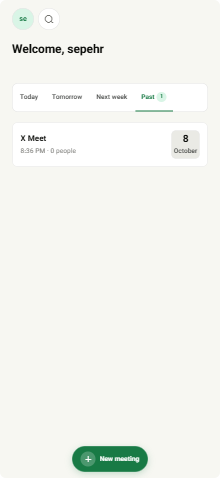
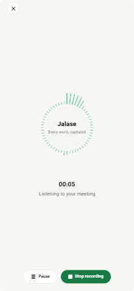
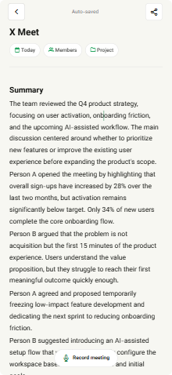
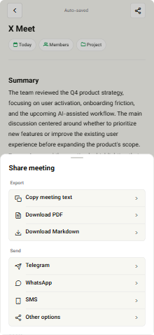
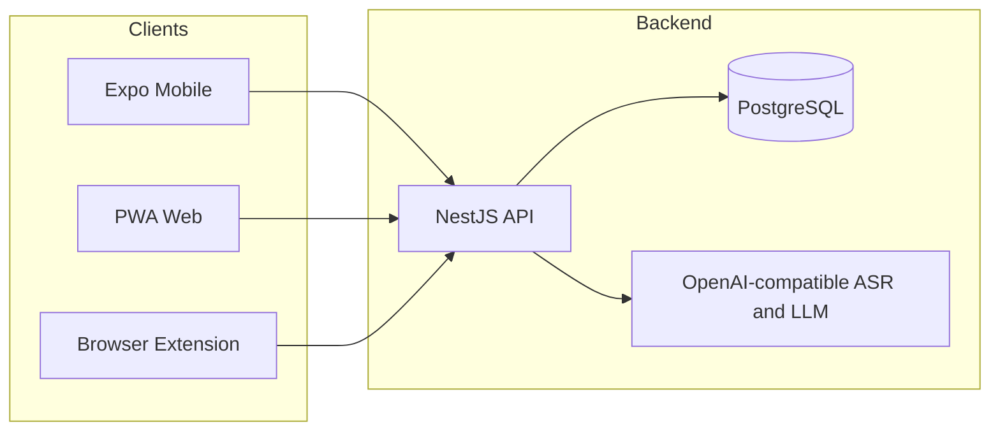

<p align="center">
  
</p>

<h1 align="center">Jalase</h1>

<p align="center">
  <strong>The open-source AI notebook for real meetings.</strong><br />
  Record the conversation. Capture the transcript. Walk away with decisions and next actions.
</p>

<p align="center">
  <a href="#quick-start"></a>
  <a href="LICENSE"></a>
  <a href="#architecture"></a>
  <a href="#internationalization"></a>
</p>

<p align="center">
  <a href="#features">Features</a> ·
  <a href="#evaluation--reliability">Evaluation</a> ·
  <a href="#screenshots">Screenshots</a> ·
  <a href="#why-jalase">Why Jalase</a> ·
  <a href="#architecture">Architecture</a> ·
  <a href="#quick-start">Quick start</a> ·
  <a href="#configuration">Configuration</a> ·
  <a href="#api">API</a> ·
  <a href="#contributing">Contributing</a>
</p>

---

## Screenshots

<p align="center">
  
  &nbsp;
  
  &nbsp;
  
</p>

<p align="center">
  
  &nbsp;
  
</p>

| | |
|---|---|
| **Home** | Empty state walkthrough and past-meeting list |
| **Recording** | Live capture with waveform and pause / stop controls |
| **Notes** | Meeting summary with date, members, and project chips |
| **Share** | Copy text, download PDF / Markdown, send via apps |

---

## Why Jalase

Most AI meeting tools feel like chatbots with a microphone strapped on.

Jalase is built around a different metaphor:

```text
Meeting → Conversation → Notes → Insight → Decision → Action
```

It is a **decision notebook**, not an AI theater.

- Quiet, paper-like product UI (cream canvas, hairline borders, green accent)
- AI stays embedded in the workflow instead of dominating the screen
- English-first and LTR by default, with full Persian (RTL) as a second language
- Self-hostable monorepo: API, mobile/PWA, and browser extension in one place

---

## Features

| Area | What you get |
|------|----------------|
| **Capture** | Live meeting recording with a focused recorder experience |
| **Transcribe** | Hybrid ASR pipeline (diarize + transcribe) via OpenAI-compatible APIs |
| **Refine** | Post-pass transcript cleanup before notes settle |
| **Insights** | One-shot extraction for summary, decisions, next actions, highlights |
| **Notes** | Structured notebook sections with TipTap editing |
| **Projects** | Group meetings into projects |
| **Search** | Full-text search across notes and transcripts |
| **Auth** | Email OTP (international) + Iranian phone OTP |
| **i18n** | `en` (default, LTR) and `fa` (RTL) with a language switcher |
| **Dates** | Gregorian calendar everywhere (Latin digits) |
| **Extension** | Meet-side capture UI with locale-aware direction |

> Billing / payment gateways are **disabled** in this open-source build. Personal-tier capabilities are available without a paywall.

---

## Evaluation & Reliability

Jalase is scored like a **Decision Notebook**, not a chatbot demo: can people trust the transcript, the decisions, the next actions, and the summary?

<p align="center">
  
  
  
  
</p>

### Published baseline

Curated **AMI-style** (ASR) and **QMSum-style** (insights) fixtures ship in [`packages/eval`](packages/eval). Numbers below come from `npm run eval:baseline` and are checked into [`packages/eval/results/baseline.json`](packages/eval/results/baseline.json).

| Suite | Corpus | Metric | Result |
|-------|--------|--------|-------:|
| Transcription | AMI-style (3 meetings) | Weighted WER | **3.2%** |
| Transcription | AMI-style | Weighted CER | **0.0%** |
| Decisions | QMSum-style (3 meetings) | Micro-F1 | **100%** |
| Next actions | QMSum-style | Micro-F1 | **100%** |
| Summary | QMSum-style | Faithfulness (LLM-as-judge, 1–5) | **4.67** |

What we measure:

- **WER** – word error rate after normalize + Levenshtein alignment
- **Extraction F1** – greedy token-Jaccard match (≥ 0.5) vs human gold decisions / actions
- **Faithfulness** – fixed rubric LLM-as-judge; CI uses cached scores when no API key is present

```bash
npm run eval:baseline       # full report + rewrite baseline.json
npm run eval:wer            # ASR only
npm run eval:extractions    # decisions + next actions
npm run eval:faithfulness   # summary judge (live if AVALAI_API_KEY is set)
```

### Guardrails, logging, latency

| Layer | What ships |
|-------|------------|
| **Guardrails** | Transcript sufficiency, evidence/confidence filters, EN/FA prompt-injection checks, log PII redaction (`ai.guardrails`) |
| **Logging** | Structured JSON via `nestjs-pino`, `x-request-id`, `pipeline.stage` events for ASR / review / extract |
| **Latency** | HTTP interceptor + in-memory stage stats; `GET /api/v1/health/metrics` in development (or `METRICS_ENABLED=true`) |

Deep dive: [Evaluation & observability architecture](docs/architecture/evaluation-observability.md).

> These fixtures are small, English, decision-heavy meetings for CI and docs. They are **not** a claim over the entire AMI or QMSum corpora. Run a full local dump separately for research-scale numbers.

---

## Architecture

```text
jalase/
├── apps/
│   ├── api/          NestJS + TypeORM + PostgreSQL   →  /api/v1
│   ├── mobile/       Expo (React Native) + PWA web
│   └── extension/    WXT browser extension
├── packages/
│   ├── shared/       Types, feature flags, note/transcript utils
│   └── eval/         Offline WER / F1 / faithfulness harness
├── docs/             Feature + architecture documentation
├── docker-compose.yml
└── .env.example      Single source of truth for configuration
```



| Layer | Technology |
|-------|------------|
| API | NestJS, TypeScript, Swagger (`/api/docs`), JWT auth |
| Data | PostgreSQL 16 via Docker Compose |
| Mobile / Web | Expo Router, React Native, React Native Web |
| Shared | `@jalase/shared` workspace package |
| Extension | WXT + React |
| i18n | `i18next` / `react-i18next` |

---

## Quick start

### Requirements

- Node.js **20+**
- Docker Desktop (PostgreSQL)
- npm (workspaces)

### 1. Clone and install

```bash
git clone https://github.com/sepehr-safaeian/jalase.git
cd jalase
npm install
```

### 2. Configure environment

```bash
cp .env.example .env
```

Open `.env` and set at least:

| Variable | Purpose |
|----------|---------|
| `JWT_SECRET` | Long random string for production |
| `AVALAI_API_KEY` | API key for your OpenAI-compatible provider |
| `AVALAI_BASE_URL` | Provider base URL (AvalAI, OpenAI, Groq-compatible, etc.) |
| `EXPO_PUBLIC_API_URL` | Client → API URL (default `http://localhost:3000/api/v1`) |

See [Configuration](#configuration) for the full matrix.

### 3. Start Postgres

```bash
npm run docker:up
```

Postgres listens on **localhost:5434** by default (avoids collisions with other local stacks).

### 4. Build shared types and run the API

```bash
npm run build:shared
npm run dev:api
```

- API: http://localhost:3000/api/v1  
- Swagger: http://localhost:3000/api/docs  

### 5. Run the web app

```bash
npm run dev:web
```

- PWA / web: http://localhost:8081  

### Optional: mobile & extension

```bash
npm run dev:mobile      # Expo custom dev client
npm run dev:extension   # Browser extension (WXT)
```

### Development sign-in

In `NODE_ENV=development`, OTP codes are logged to the API console and use the fixed code:

```text
123456
```

Prefer **email OTP** for international / English usage. Iranian phone OTP (`+98…`) remains available.

---

## Configuration

All secrets and tunables live in **`.env`** (copied from [`.env.example`](.env.example)).

```bash
cp .env.example .env
```

Workspace-specific templates also exist for clarity:

| File | Scope |
|------|--------|
| [`.env.example`](.env.example) | Root / recommended single file |
| [`apps/api/.env.example`](apps/api/.env.example) | API-only overrides |
| [`apps/mobile/.env.example`](apps/mobile/.env.example) | Expo public vars |
| [`apps/extension/.env.example`](apps/extension/.env.example) | Extension build vars |

### Core variables

| Key | Default | Description |
|-----|---------|-------------|
| `DATABASE_URL` | docker local URL | Postgres connection string |
| `API_PORT` | `3000` | HTTP port |
| `JWT_SECRET` | _(change me)_ | Signing secret for access tokens |
| `JWT_EXPIRES_IN` | `7d` | Token lifetime |
| `DEFAULT_TIER` | `plus` | Feature-flag tier for OSS |
| `EXPO_PUBLIC_API_URL` | `http://localhost:3000/api/v1` | Client API base |
| `TRANSCRIBE_LANGUAGE` | `en` | Default ASR language (`en` / `fa`) |
| `LOG_LEVEL` | `info` | Pino log level |
| `LOG_PRETTY` | `true` (dev) | Pretty-print logs locally |
| `METRICS_ENABLED` | `false` | Expose `/health/metrics` outside development |

### AI provider variables

Jalase talks to **OpenAI-compatible** endpoints. AvalAI is one option; you can point `AVALAI_BASE_URL` at any compatible host.

| Key | Description |
|-----|-------------|
| `AVALAI_API_KEY` | Provider API key |
| `AVALAI_BASE_URL` | e.g. `https://api.avalai.ir/v1` or OpenAI-compatible URL |
| `AVALAI_DIARIZE_MODEL` | Speaker diarization model |
| `AVALAI_TRANSCRIBE_MODEL` | Speech-to-text model |
| `AVALAI_REFINE_MODEL` | Transcript review model |
| `AVALAI_EXTRACT_MODEL` | Meeting insight extraction model |
| `AVALAI_*_ENABLED` | Feature toggles for refine / extract |

> **Security:** never commit a real `.env`. Rotate any key that was ever pasted into chat logs or screenshots.

---

## Internationalization

| Locale | Direction | Status |
|--------|-----------|--------|
| **English (`en`)** | LTR | **Default** |
| Persian (`fa`) | RTL | Supported via Settings → Language |

- UI strings: `apps/mobile/i18n/locales/{en,fa}.json`
- Extension: `apps/extension/public/_locales/{en,fa}/`
- Dates: **Gregorian only**, Latin digits
- AI prompts: locale-aware packs for refine / extract

---

## API

Base path: `/api/v1`

Interactive docs: [http://localhost:3000/api/docs](http://localhost:3000/api/docs) when the API is running.

Highlighted groups:

- `auth` - phone OTP, email OTP, profile, settings
- `notes` - CRUD, search, members, speaker mappings, insights
- `projects` - project management
- `notes/:id/recording` - start / chunk / stop / finalize transcription
- `health` - liveness

Feature flags are defined in `packages/shared` and evaluated in the API.

---

## Scripts

| Command | Description |
|---------|-------------|
| `npm run docker:up` | Start PostgreSQL |
| `npm run docker:down` | Stop PostgreSQL |
| `npm run build:shared` | Compile `@jalase/shared` |
| `npm run dev:api` | API watch mode |
| `npm run dev:web` | Expo web / PWA |
| `npm run dev:mobile` | Expo mobile |
| `npm run dev:extension` | Extension dev server |
| `npm test` | Run workspace tests |
| `npm run lint` | Lint workspaces |
| `npm run eval:baseline` | Publish evaluation baseline JSON |
| `npm run eval:wer` | AMI-style WER suite |
| `npm run eval:extractions` | Decision / action F1 suite |
| `npm run eval:faithfulness` | Summary faithfulness suite |

---

## Design language

Jalase deliberately avoids the “purple AI SaaS” look.

- Canvas: warm paper `#F7F7F2`
- Primary: organic green `#187A45`
- Accent: highlighter yellow (emphasis, not chrome)
- Typography: Vazirmatn for UI and headlines
- Shape: 8px cards, pill CTAs used sparingly
- Hierarchy: border-driven, minimal shadow

Product UI stays calm. Marketing surfaces can be more expressive.

---

## Roadmap ideas

Contributions welcome in any of these directions:

- [x] Offline evaluation harness (WER, extraction F1, faithfulness) + structured logging
- [ ] Additional ASR / LLM providers as first-class adapters
- [ ] Richer email delivery for OTP (SMTP / transactional mail)
- [ ] Desktop packaging from the same RN/web codebase
- [ ] Offline-tolerant recording queue
- [ ] Deeper calendar integrations
- [ ] More locales on top of `en` / `fa`
- [ ] Full AMI / QMSum research dumps beyond curated fixtures

---

## Contributing

Read [CONTRIBUTING.md](CONTRIBUTING.md) before opening a PR.

High-level flow:

1. Fork and branch from `main`
2. Keep changes focused
3. Add tests for behavior changes
4. Keep English as the default locale
5. Open a PR with a clear summary and test plan

Security reports: see [SECURITY.md](SECURITY.md).

---

## License

Released under the [MIT License](LICENSE).

---

<p align="center">
  <sub>Built for people who leave meetings with decisions, not just recordings.</sub>
</p>
